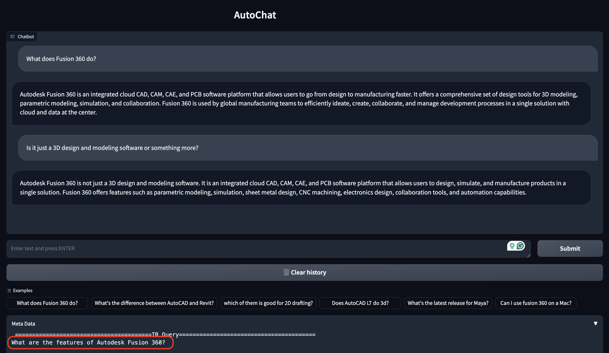

# AutoChat: A RAG system for Autodesk

This project introduces a demo of a Retrieval Augmented Generation (RAG) system, with the following abilities:

- Utilizing an Information Retrieval (IR) tool to provide responses grounded in reliable sources of information
- Not answering questions based on the parametric knowledge of the LLMs, thus enhancing the precision and avoiding potential hallucination
- Converting chat history into queries appropriate for the IR tool
- Engaging in natural conversations with users

For a deeper understanding of these capabilities, please explore the Examples section below.

The IR tool combines an HTML Text Splitter with a Recursive Character Text Splitter followed by a Deduplicator module for removing duplicated pieces of texts (chunks).

## Installation and Setup

First of all create the conda env for the project.

#### Environment Setup

```bash
cd auto_chat
conda create --name auto_chat python=3.10
conda activate auto_chat
pip install -r requirements.txt
```

#### Vector Database Creation

Now lests create the Vector Database. You can edit the following config file to customize parameters regarding the page loader, text pplitters, deduplicator, embedding models, and vector database.

```
auto_chat/helpers/configs/create_vector_db_configs.json
```

First of all move a `pages` folder containing all .html files to the following path:

```
auto_chat/data/pages
```

Then set your OpenAI API key as an environment variable or in the config file. The key specified in the config file (if specified) overrides the environemnt variable.

```
export OPENAI_API_KEY=...
```

Now creat the vector database file:

```bash
sh ./helpers/scripts/create_vectordb.sh
```

#### Running the ChatBot server!

After creating the Vector DB you are ready to run the demo!
You can customize the parameters by editing the following config file. Remeber to set your OpenAI key in this config file or as an environemnt variable:

```
auto_chat/helpers/configs/server_configs.json
```

Run the following scrip to bring up the AutoChat demo.

```bash
sh helpers/scripts/run_chat_server.sh
```

You should be able to access the AutoChat demo using this address: http://0.0.0.0:8892:

## Examples

In this section we will show the output of the system on the following question while showing some features.

1. What does Fusion 360 do?
2. What's the difference between AutoCAD and Revit?
3. Does AutoCAD LT do 3d?
4. What's the latest release for Maya?
5. Can I use fusion 360 on a Mac?

#### Chat and Retrieve (when necessary)

The chatbot has the ability to chat with user and to retrieve information using an Information Retrieval (IR) tool when a question is asked.
If the user just wants to chat, the IR tool is not invoked.


In this example the IR tool is invoked to answer the question "What's the difference between AutoCAD and Revit?".

You can find the details regarding the IR tool intput and outputs in the Metadata section.

#### Converting chat history to stand-alone question

In the middle of the conversation the user may ask a question that is not a stand-alone question.
For example consider the following example:



In this example, after the first question the user has asked "Is it just a 3D design and modeling software or something more?". In this follow up question, "it" refers to the Fusion 360. Passing the follow up question to the IR tool will not give us the information we want to answer this question.

To solve this problem we transform the conversation into a stand-alone question to be passed to the IR tool. As you can see in the Metadata section, the query "What are the features of Autodesk Fusion 360?" is obtained based on the conversation for answering the follow up question of the user.

#### Answer just based on the retrieved information

The chatbot should not say anything from its parametric knowledge. To increase the precision of the chatbot we want all the answers to be grounded in the retrieved information. If the retrieved information is not enough to answer the question then the chatbot will not answer the question and will refer the user to the customer service. In the following example, the model could find the  answer of "Who is the president of Autodesk" in the retrieved information so answers the question. But for the first and last question the retrieved information was not useful for answering the question. So it refuses to answer.


The following image shows another example of not finding supporting information from the IR tool.


#### More Examples

The following images shows the answer of the chatbot on the rest of the sample questions:


